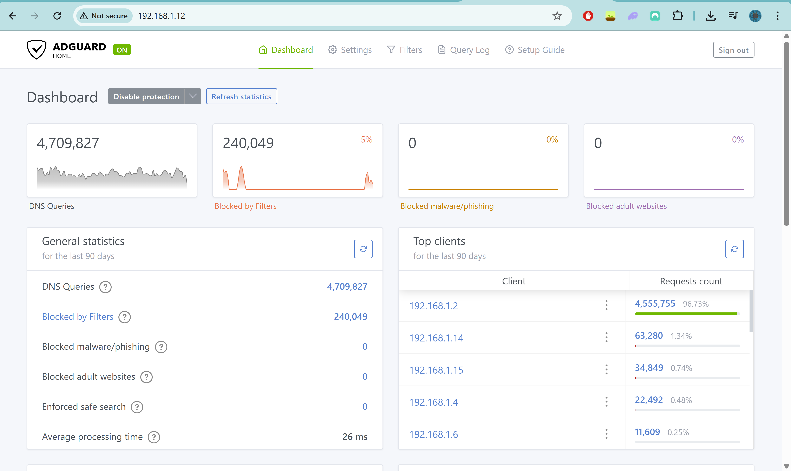

# Raspberry Pi Zero 2 W - Network Wide Ad Blocking with AdGuard Home

## Overview

This project involved repurposing an old Raspberry Pi Zero 2 W into a network-wide ad blocker using AdGuard Home.

The main goal of the project was to gain more hands-on experience with:

* Networking
* DNS & DHCP
* Linux
* Router configuration
* Secure DNS
* Infrastructure concepts

Instead of blocking ads on individual devices through browser extensions, this setup filters DNS requests at the network level, allowing all connected devices on the home network to benefit from centralised ad and tracker blocking.

---

# Hardware & Software Used

## Hardware

* Raspberry Pi Zero 2 W
* microSD Card
* Power Supply
* Home Router
* PC/Desktop

## Software

* Raspberry Pi OS Lite
* AdGuard Home
---

# Initial Setup

## 1. Installing Raspberry Pi OS Lite

I used Raspberry Pi OS Lite for a lightweight headless setup without a desktop environment.

The Raspberry Pi Imager was used to:

* Flash Raspberry Pi OS Lite to the microSD card
* Enable SSH
* Configure WiFi credentials
* Configure login credentials

---

# Remote Access with SSH

After booting the Raspberry Pi, I connected to it remotely using SSH through my Windows PC.

# Change this!!! (need more data from home)
```bash
ssh pi@raspberrypi-ip
```

This allowed me to manage the Raspberry Pi entirely through the Linux terminal.

---

# Installing AdGuard Home

The Raspberry Pi was updated before installing AdGuard Home.

```bash
sudo apt update
curl -s -S -L https://raw.githubusercontent.com/AdguardTeam/AdguardHome/master/scripts/install.sh | sh -s -- -v
```

AdGuard Home was then installed and configured as the network's DNS server.

---

# Router Configuration

To ensure all devices on the home network automatically use AdGuard Home, the router's DNS settings were updated to point to the Raspberry Pi.

A DHCP reservation was configured so the Raspberry Pi would always keep the same IP address on the network.


---

# Secure DNS Configuration

As part of the setup, secure DNS features were configured, including:

* DNS-over-HTTPS (DoH)
* DNSSEC

Upstream DNS providers explored included:

* Quad9
* Cloudflare
* Google DNS

This helped improve:

* Privacy
* Security
* DNS request integrity

---

# What I Learned

Some of the key concepts and technologies I learned more about during this project include:

* DNS & DHCP
* Linux terminal usage
* SSH remote management
* Router & network configuration
* DNS sinkholes
* Network-wide filtering
* Secure DNS technologies
* Home lab infrastructure concepts

One of the most interesting parts of the project was learning how DNS sinkholes work. AdGuard Home blocks requests to known ad/tracker domains by redirecting them to a controlled IP address such as:

```text
0.0.0.0
```

This prevents devices from ever reaching those ad servers.

---

# Challenges

Some of the challenges encountered during the project included:

* Understanding router DNS configuration
* Configuring DHCP reservations
* Learning how devices receive DNS settings
* Understanding why some ads (such as YouTube ads) are difficult to block using DNS filtering alone

---

# Future Improvements

Some future ideas for expanding this project include:

* Network-wide VPN setup
* DNS leak testing
* Performance optimization
* Advanced filtering rules
* Additional home lab networking projects

---

# Screenshots



---

# Final Thoughts

This project was a great hands-on introduction to networking, Linux, DNS infrastructure, and home lab environments.

It also showed how much can be learned by repurposing older hardware and building practical, real-world projects.

