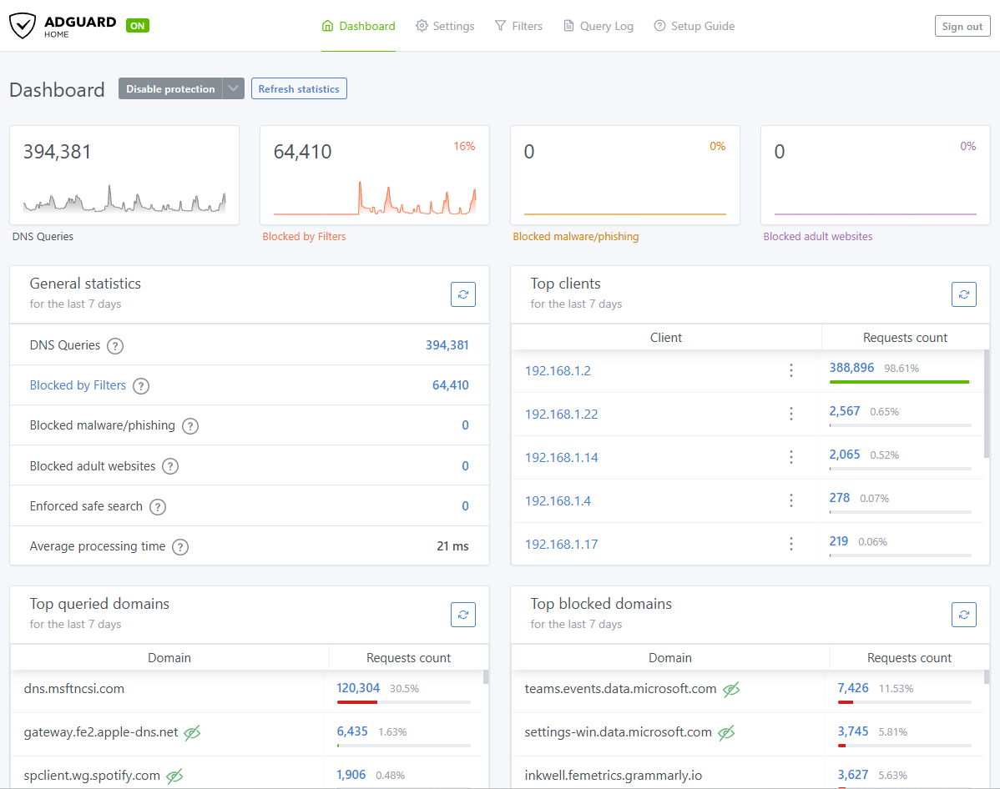
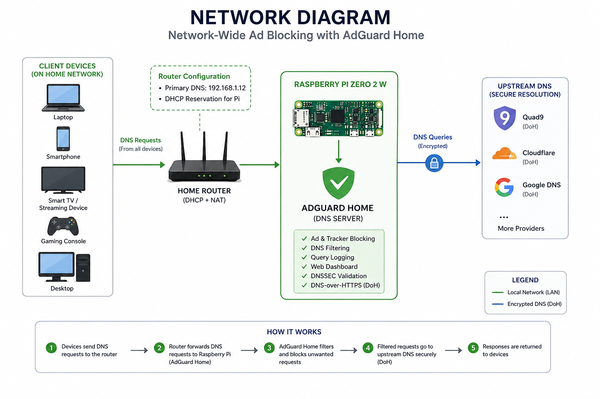
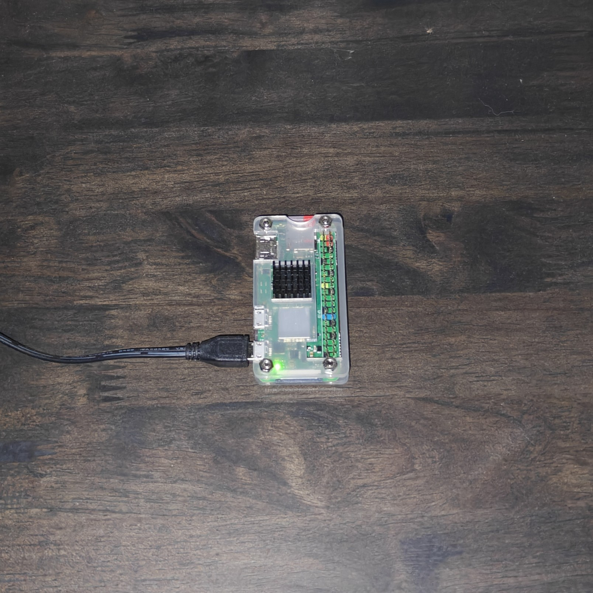
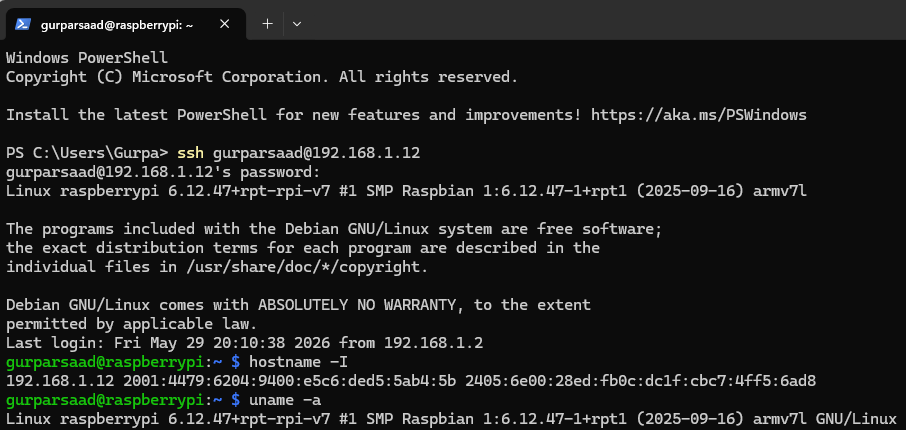
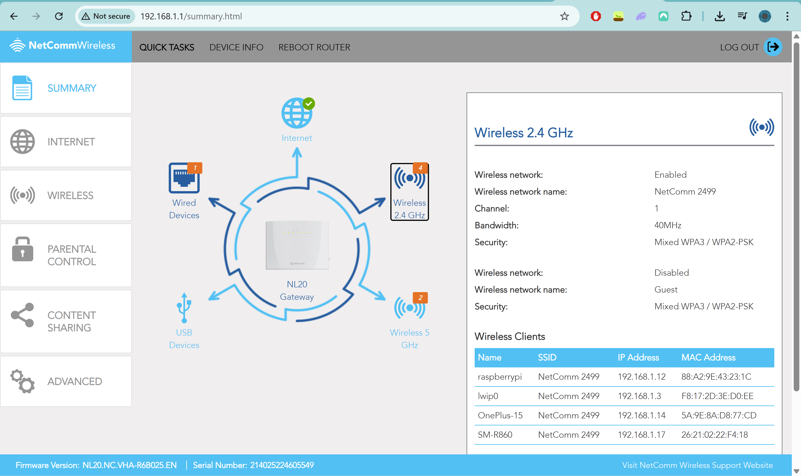
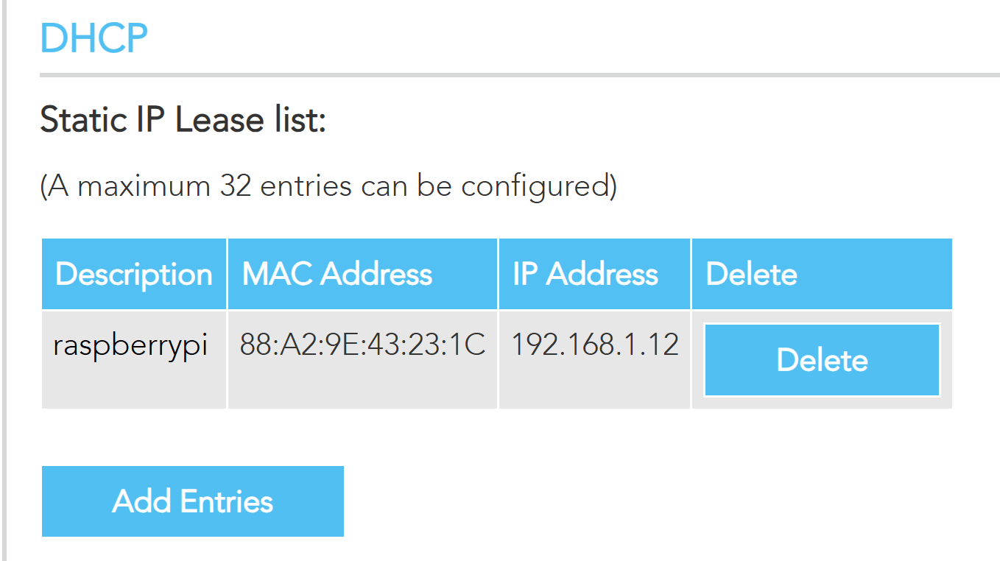

# Raspberry Pi Zero 2 W - Network-Wide Ad Blocking with AdGuard Home

## Overview

This project involved repurposing an old Raspberry Pi Zero 2 W into a network-wide ad blocker using AdGuard Home.

The goal was to gain hands-on experience with networking, DNS, DHCP, Linux, router configuration, and secure DNS technologies while building something useful for my home network.

Instead of blocking ads on individual devices through browser extensions, this setup filters DNS requests at the network level, allowing all connected devices to benefit from centralised ad and tracker blocking.

---

## Project Result



Over the last 7 days, the AdGuard Home instance processed:

* **394,381 DNS queries**
* **64,410 queries blocked**
* **16% block rate**
* **21 ms average processing time**
* **5+ active devices protected**

These results show how DNS-level filtering can reduce advertising and tracking requests across a home network while maintaining low latency.

---

## Architecture



The router is configured to send DNS requests to the Raspberry Pi, which runs AdGuard Home. AdGuard filters unwanted ad/tracker domains locally, then forwards allowed DNS queries to upstream providers using secure DNS.

---

## Hardware & Software Used

**Hardware**

* Raspberry Pi Zero 2 W
* microSD card
* Power supply
* Home router
* Windows PC

**Software**

* Raspberry Pi OS Lite
* AdGuard Home
* Windows PowerShell
* SSH

---

## Hardware Setup



The Raspberry Pi Zero 2 W was used as a lightweight DNS filtering server for the home network.

---

## Setup Process

Raspberry Pi OS Lite was used for a headless setup without a desktop environment.

Using Raspberry Pi Imager, I configured:

* Raspberry Pi OS Lite
* SSH access
* WiFi credentials
* Login credentials

After booting the Raspberry Pi, I connected to it remotely using SSH from my Windows PC:

```bash
ssh gurparsaad@192.168.1.12
```



This allowed me to manage the Raspberry Pi through the Linux command line.

---

## Installing AdGuard Home

The Raspberry Pi was updated before installing AdGuard Home:

```bash
sudo apt update
curl -s -S -L https://raw.githubusercontent.com/AdguardTeam/AdguardHome/master/scripts/install.sh | sh -s -- -v
```

AdGuard Home was then installed and configured as the network’s DNS server.

---

## Router Configuration

To make the setup network-wide, the router’s DNS settings were updated so connected devices would use the Raspberry Pi as their DNS server.



A DHCP reservation was also configured so the Raspberry Pi would always receive the same IP address.



This helped me understand:

* DNS
* DHCP
* DHCP reservations
* Static IP concepts
* Network-wide DNS filtering

---

## Secure DNS

As part of the setup, I explored secure DNS features including:

* **DNS-over-HTTPS (DoH):** encrypts DNS queries between AdGuard Home and upstream DNS providers.
* **DNSSEC:** helps verify that DNS responses are authentic and have not been tampered with.

Upstream DNS providers explored included:

* Quad9
* Cloudflare
* Google DNS

---

## Results

| Metric                              |   Value |
| ----------------------------------- | ------: |
| DNS Queries Processed               | 394,381 |
| Queries Blocked                     |  64,410 |
| Block Rate                          |     16% |
| Average Processing Time             |   21 ms |
| Malware / Phishing Requests Blocked |       0 |
| Adult Websites Blocked              |       0 |

Frequently blocked domains included:

* teams.events.data.microsoft.com
* settings-win.data.microsoft.com
* inkwell.femetrics.grammarly.io

---

## What I Learned

This project helped me better understand:

* DNS and DHCP
* Linux terminal usage
* SSH remote management
* Router configuration
* DNS sinkholes
* Network-wide filtering
* Secure DNS technologies
* Home lab infrastructure

One of the most interesting concepts was learning how DNS sinkholes work. AdGuard Home blocks requests to known advertising and tracking domains by redirecting them to a controlled address such as:

```text
0.0.0.0
```

This prevents devices from reaching unwanted ad or tracking servers.

---

## Challenges

Some challenges included:

* Understanding router DNS settings
* Configuring DHCP reservations
* Learning how devices receive DNS settings
* Understanding the difference between static routes, static IP addresses, and DHCP reservations
* Understanding why some ads, such as YouTube ads, are difficult to block with DNS filtering alone

---

## Future Improvements

* Configure a network-wide VPN
* Perform DNS leak testing
* Benchmark DNS performance
* Explore advanced filtering rules
* Add additional home lab services
* Build a centralised home lab dashboard

---

## Final Thoughts

This project was a practical introduction to networking, Linux, DNS infrastructure, and home lab environments.

It showed how a low-cost Raspberry Pi can be repurposed into useful network infrastructure while building hands-on experience with secure DNS, router configuration, and network-wide filtering.
